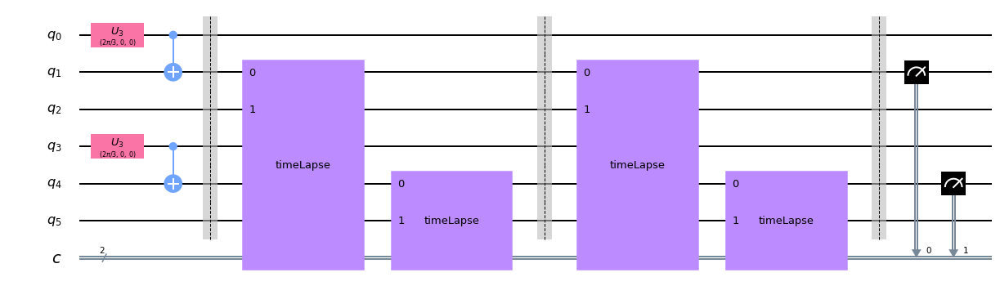

# Quantum Hackathon 2019: Quantum Artificial Life 

Este proyecto trata el tema de la creacion y simulacion de vida artificial. Nos basamos en el paper [Quantum Artificial Life](https://www.nature.com/articles/s41598-018-33125-3). En este se muestra la posibilidad de simular dos entes de dos qubit. En nuestro proyecto creamos un entorno para la generacion de circuitos de una cantidad mmayor de individuos, asi como indagar en formas diferentes de reproduccion, evolucion y mutacion.

El documento **simulation.ipynb** contiene de forma visual todos los metodos para la generacion de los ya mencionados, junto con una explicacion simple del funcionamiento de los mismos.

